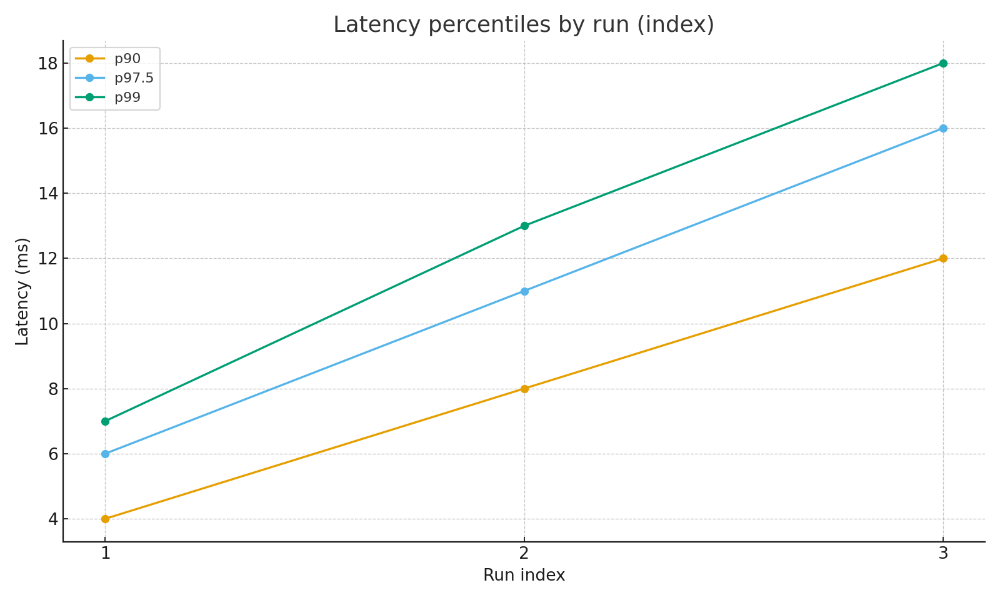
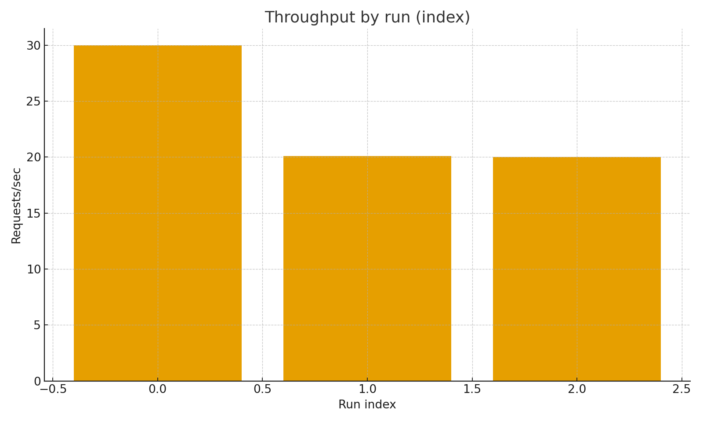

**Tool:** [nest-perf-analyzer (npm)](https://www.npmjs.com/package/nest-perf-analyzer) • **Repo:** https://github.com/aminsf/nest-perf-analyzer • **Example app:** `examples/nestjs-app`

## TL;DR

A tiny CLI to benchmark REST/GraphQL endpoints with **p90 / p97.5 / p99**, throughput, and error rate. It prints JSON and can append a CSV row so you can chart results and compare runs.

## Reproduce locally

```bash
# 1) Start the example app
cd examples/nestjs-app
npm i
npm run dev
# http://localhost:3000 (REST: /health, GraphQL: /graphql)

# 2) From repo root, build and run the CLI
npm run build

# REST baseline
node dist/index.js rest --url http://localhost:3000/health --duration 10 --rps 30 --concurrency 10 --csv results.csv

# GraphQL baseline
node dist/index.js gql --url http://localhost:3000/graphql --query ./examples/nestjs-app/queries/hello.graphql --duration 10 --rps 20 --concurrency 10 --csv results.csv

# GraphQL with latency
node dist/index.js gql --url http://localhost:3000/graphql --query ./examples/nestjs-app/queries/sleep.graphql --duration 10 --rps 20 --concurrency 10 --csv results.csv
```

## Results

| url                                   | duration (s) | rps | conc | p50 (ms) | p90 (ms) | p97.5 (ms) | p99 (ms) | throughput (req/s) | errors | errorRate |
| ------------------------------------- | -----------: | --: | ---: | -------: | -------: | ---------: | -------: | -----------------: | -----: | --------: |
| http://localhost:3000/health          |           10 |  30 |   10 |        2 |        4 |          6 |        7 |               30.0 |      0 |        0% |
| http://localhost:3000/graphql (hello) |           10 |  20 |   10 |        3 |        8 |         11 |       13 |              20.11 |      0 |        0% |
| http://localhost:3000/graphql (sleep) |           10 |  20 |   10 |        6 |       12 |         16 |       18 |               20.0 |      0 |        0% |

**Charts** (generated from `results.csv`):

- 
- 

## Notes

- `autocannon` exposes **p50/p90/p97.5/p99** (not p95).
- Use a short **warmup** to stabilize results.
- Track changes over time by committing `results.csv` with each PR.
- The `sleep` GraphQL resolver has a default delay, so the example works without variables.

## Why this exists

Tail latency reflects real user experience better than averages. This workflow keeps performance transparent and reproducible for teams building NestJS/GraphQL APIs (but it works for any HTTP endpoint).
